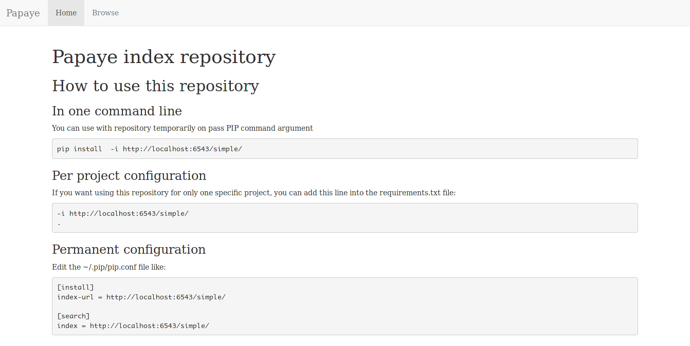
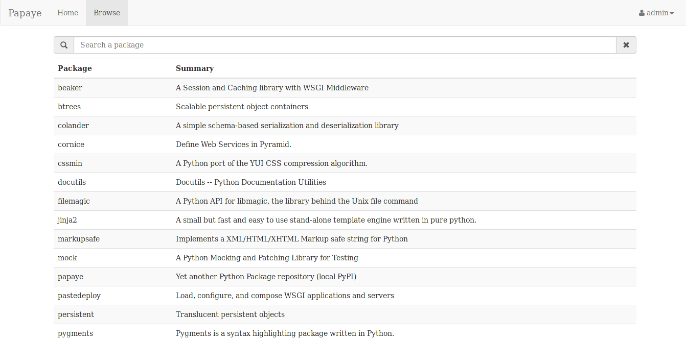
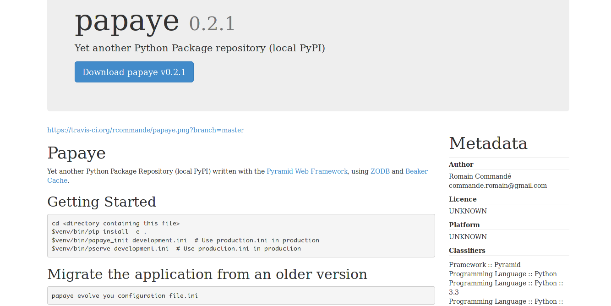

Papaye 0.2 est arrivé !
#######################
:date: 2015-06-07
:tags: Programmation, Développement, Python, Projet

.. role:: strike
    :class: strike

Ça y est! Après de longs mois d'attente, j'ai enfin pu sortir une nouvelle release de Papaye ! Pour rappel, c'est une application que je développe depuis quelques temps et qui permet d'avoir un dépôt de paquets Python en local tout en faisant également office de proxy et de cache pour le dépôt PyPI officiel.

Autant dire la vérité, ça n'a pas été de la tarte (`à la papaye ...`_). Je suis parti sur une brique logicielle assez exotique (la `ZODB`_ en chef de file) ce qui fait qu' au moindre problème, je me sentais bien seul, :strike:`Google` DuckDuckGo n'était pas toujours d'une grande aide. J'ai notamment été confronté à des problèmes de conflits de transactions et de migrations de données.

Les nouveautés
--------------
Un petit mot sur les nouveautés:

* Une interface web afin de naviguer dans les paquets
* Un nouveau scheduler pour la gestion des tâches en arrière plan
* Un système de migrations de données basé sur `repoze.evolution`_ (un prochain article sur mon retour d'expérience) et inspiré par `South`_ / `Alembic`_

L'application arrive également avec son petit lot de pansements :

* L'arbre de la base de données ne se déteriore plus dans le temps
* La configuration de webassets ne pose plus de problème en production
* Le système de proxy/cache possédait de nombreux bugs. Il a été entièrement réécrit
* Les paquets ayant des espaces dans leur nom sont correctement pris en charge.

L'interface web
---------------
La grosse nouveauté c'est donc l'interface qui permet de naviguer dans les paquets. En voici quelques images:

La page d'accueil:

La liste des paquets avec un champs de filtrage:

Le détail d'un paquet:

Pour les utilisateurs d'une des versions précédentes de Papaye, il faudra exécuter une commande suplémentaire afin de migrer/nettoyer votre ancienne base de données

.. code-block:: sh

    papaye_evolve votre_fichier_de_configuration.ini

Papaye vous obligera de toute façon à exécuter cette commande si vous ne le faites pas.

Au passage, je fais tourner une version "demo" ici: http://papaye.rcommande.org/  (demo/demo pour s'identifier)

La suite
--------

Il reste encore un bout de chemin mais je considère cette version comme la première réellement utilisable et reposant sur des bases solides.
La prochaine étape, c'est l'enrichissement de l'interface web avec une interface d'administration pour gérer la base de données (opérations de maintenances), purger le cache des paquets, manipuler le dépôt (édition, suppression, ...) et gérer les utilisateurs.
Je vais aussi essayer de travailler sur la documentation, qui est pour le moment...inexistante. La faute à mon anglais très aproximatif.

Et surtout n'hésitez pas à me faire le maximum de retours concernant cette version. Ça se passe toujours sur `le dépôt Github`_

Merci également a `Foxmask`_ et `Ldgeo`_ pour leurs remontées et corrections !

.. _Foxmask: https://github.com/foxmask
.. _ldgeo: https://github.com/ldgeo
.. _à la papaye ...: http://www.marmiton.org/recettes/recette_tarte-tatin-a-la-papaye_30690.aspx
.. _ZODB: http://www.zodb.org
.. _South: http://south.aeracode.org/
.. _Alembic: http://alembic.readthedocs.org/en/latest/
.. _repoze.evolution: https://github.com/repoze/repoze.evolution
.. _le dépôt Github: https://github.com/rcommande/papaye
